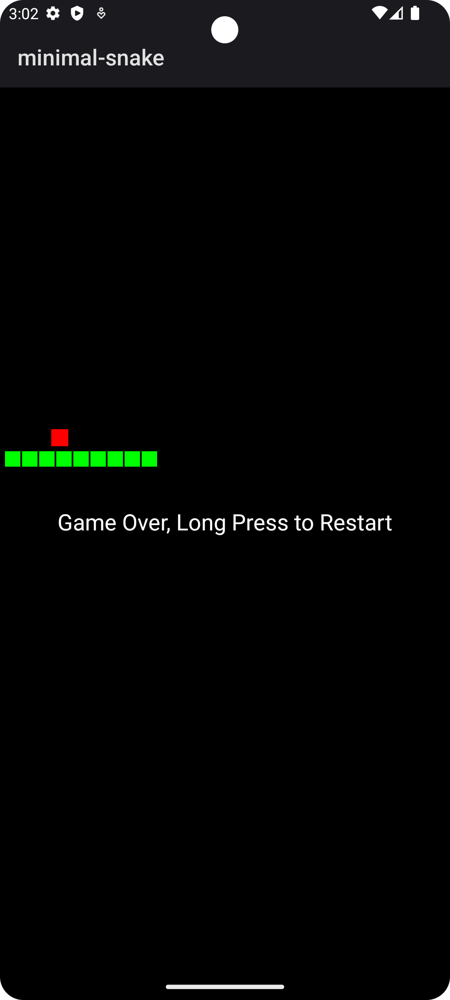

# Minimal Snake Game

Minimal Snake Game is a simple implementation of the classic Snake game for Android. It's designed
to be a lightweight(about 6kB) and straightforward game that you can enjoy on your Android device.

## Features

- Classic Snake gameplay where you control the snake to eat food and grow longer.
- Swipe-based controls to change the snake's direction.
- Responsive grid size and text size that adjust to your device's screen.
- Restart the game by long-pressing anywhere on the screen for 3 seconds.
- Minimalistic design with a black background, green snake, and red food.
- Lightweight and no external libraries or dependencies.

## How to Play

1. Launch the game on your Android device.
2. Swipe in the direction you want the snake to move (up, down, left, or right).
3. Guide the snake to eat the red food dots to grow longer.
4. Avoid hitting the walls or running into the snake's own body.
5. Try to achieve the highest score possible by eating as much food as you can.

## Restarting the Game

If you want to restart the game, simply long-press anywhere on the screen for 3 seconds. This action
will clear the current game state, and you can start a new game.

## Installation

1. Download the APK file from the TODO.
2. Open the APK file on your Android device.
3. Follow the on-screen instructions to install the game.
4. Once installed, you can find and play the game in your apps.

## Building from Source

If you want to build this game from source, you can follow these steps:

1. Clone the repository to your local machine.
2. Open the project in Android Studio.

3. Build and run the project on an Android emulator or physical device.

## Contributing

We welcome contributions to improve this minimalistic Snake game. If you find any issues or have
suggestions for enhancements, please open an issue or submit a pull request.

